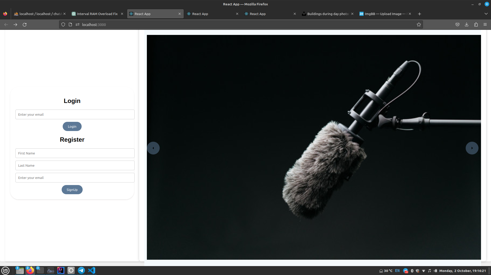
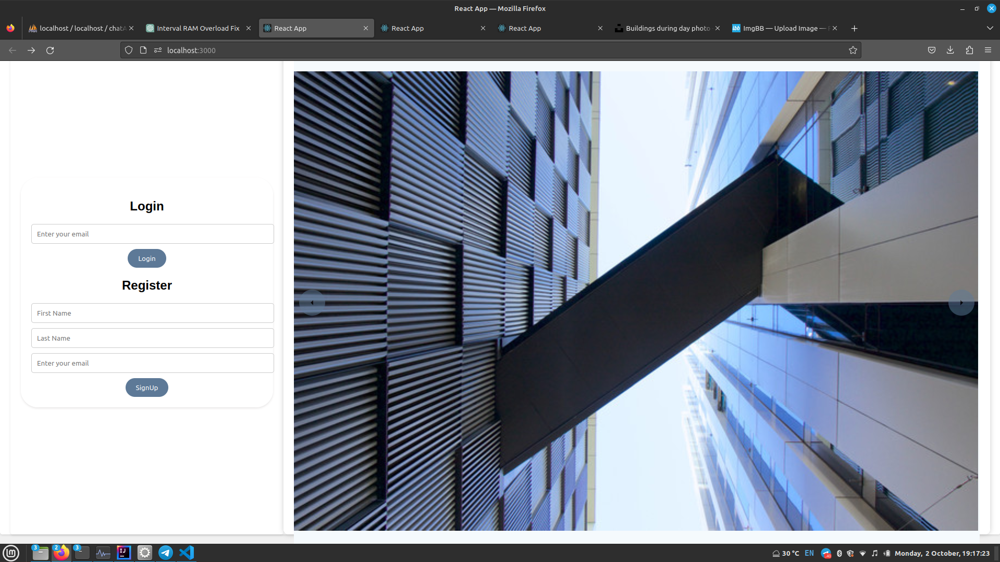
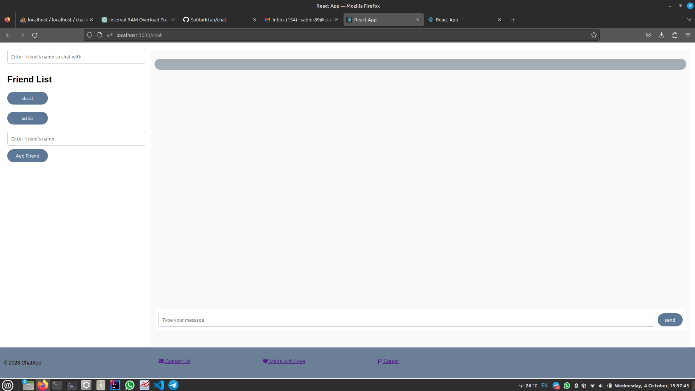
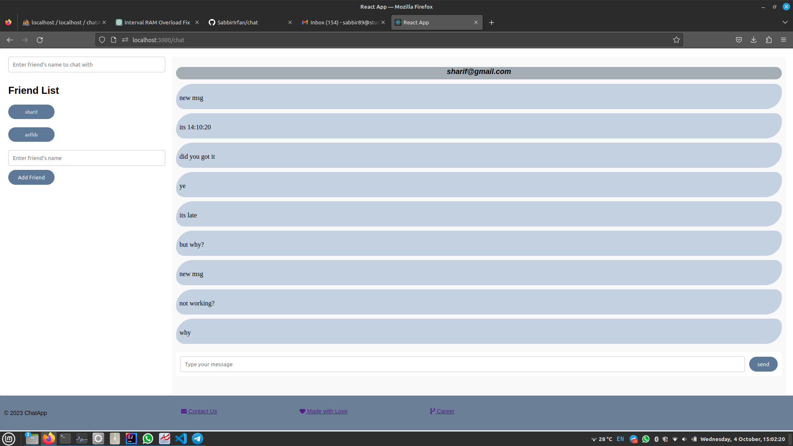

# chat# Chat App Backend (Spring Boot + MySQL)

This repository contains the backend code for a simple chat application built with Spring Boot and uses MySQL as the database. The backend provides RESTful API endpoints for user authentication, managing user profiles, and sending/receiving messages in real-time using WebSocket.

## Table of Contents

- [Getting Started](#getting-started)
 - [Preview](#preview)
- [Prerequisites](#prerequisites)
  - [Installation](#installation)
- [Configuration](#configuration)
    - [MySQL Database](#mysql-database)


## Getting Started
This chat app,  offers user registration via name and email, with email-based login.
It simplifies friend connections through names and supports private messaging.
This Chat App is built on a robust tech stack. Its backend relies on the Spring Boot Java framework, 
ensuring scalability and security. The frontend is developed using React for a dynamic user interface. 
Data is stored and managed using MySQL, ensuring reliability and efficient data retrieval.
## preview






### Prerequisites

Before you begin, ensure you have met the following requirements:

- Java Development Kit (JDK) installed (e.g., OpenJDK 11)
- MySQL database server installed
- Your favorite Integrated Development Environment (IDE) for Java (e.g., IntelliJ IDEA, Eclipse)
- [Maven](https://maven.apache.org/) for managing dependencies

### Installation

1. Clone the repository:

   ```sh
   https://github.com/SabbirIrfan/chat/
2. Open the project in intellij .

Configure your MySQL database connection in src/main/resources/application.properties. You can use the following properties as a starting point:
properties
-------------------------------------------------------------------------------------------------------------
spring.datasource.url=jdbc:mysql://localhost:3306/"YOUR_DATA_BASE_NAME"

spring.datasource.username=your_username  

spring.datasource.password=your_password  

spring.datasource.driver-class-name=com.mysql.cj.jdbc.Driver 

-------------------------------------------------------------------------------------------------------------


Build and run the application from your IDE :


## run chatsystemApplication.java


or using the following command:

sh

mvn spring-boot:run


# Chat App FrontEnd  

## Getting Started with Create React App

This project was bootstrapped with [Create React App](https://github.com/facebook/create-react-app).

## Installation
### `npm install`
### `npm audit fix --force`
### `nvm install v16`
### `npm start`

## Available Scripts

In the project directory, you can run:

### `npm start`

Runs the app in the development mode.\
Open [http://localhost:3000](http://localhost:3000) to view it in the browser.

The page will reload if you make edits.\
You will also see any lint errors in the console.


## Learn More

You can learn more in the [Create React App documentation](https://facebook.github.io/create-react-app/docs/getting-started).

To learn React, check out the [React documentation](https://reactjs.org/).

